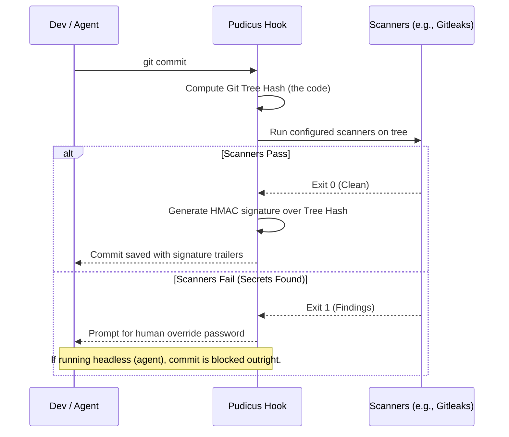
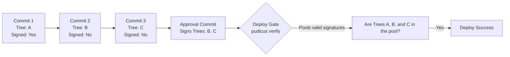

# Pudicus

Pudicus ("modest, chaste, keeping pure") is a standalone, pluggable inspection gate for Git commits. 

It was built to solve a specific problem in the era of agentic coding: **How do we ensure that AI agents (or hurried humans) actually run the necessary security and compliance checks before shipping code?**

Pudicus bridges the gap between agent automation and deployment safety by acting like an **agricultural inspector's produce sticker**. It proves that the code was scanned at the source, and a deploy gate prevents the truck from unloading if the stickers are missing.

---

## How It Works

Instead of forcing complex asymmetric cryptography on developers, Pudicus uses **"little-sister encryption"** (a simple shared HMAC secret). The agent doesn't have access to the secret, so the easiest path for the agent is simply to run the tool that holds the secret. 

If the tool (the local git hook) runs and the code is clean, the commit is signed. If the tool finds secrets, it blocks the commit unless a human manually enters the override password.

### The Commit Hook

When a commit is created, Pudicus steps in before the commit is finalized:



The resulting commit contains machine-readable Git trailers:
```text
Inspected-by: pudicus-v1
Inspection-tree: f18588e0c5f5b0a5ba281b5a78242127919d2388
Inspection-result: clean
Inspection-at: 2026-08-31T17:01:34Z
Inspection-sig: hmac-sha256:8cce6e3714782d025eb4ec4aec755...
```

### The Deploy Gate

At deployment time, you don't want to re-run expensive agentic code reviews or duplicate scans. You just want to check the receipts.

The deploy gate reads the trailers, recomputes the HMAC against the *actual* git tree hash of the commit, and fails the build if any commit in the range is unsigned, tampered with, or bypassed via `git commit --no-verify`.

---

## Retroactive Approval (Signature Pooling)

Because Git commit hashes change if you modify the commit message, you cannot easily sign old commits without rewriting history. 

To solve this, Pudicus ties the signature to the **Tree Hash** (the codebase state) rather than the **Commit Hash** (the git metadata). This allows for **Signature Pooling**.

If you have older unsigned commits (or if an agent bypassed the hook), you can run `pudicus approve`. This creates an empty "paperwork" commit that holds the signatures for the older commits.



This provides a clean escape hatch that achieves full compliance without destroying Git history.

---

## Configuration

Add a `.pudicus.yml` file to the root of your repository to define which scanners must pass before a commit is signed.

```yaml
version: 1

checkers:
  # Standard CLI scanner (e.g., Gitleaks)
  - name: gitleaks
    type: command
    command: gitleaks protect --staged --report-format json --report-path {report_file}
    success_codes: [0]
    finding_codes: [1]

  # Agent-based custom scan (e.g., Tactus security review)
  - name: tactus-security-review
    type: tactus
    procedure: security_review
```

---

## Installation & Usage

Pudicus is built in Python and requires `git` to be installed on the host machine.

### 1. Install the CLI
```bash
pip install git+ssh://git@github.com/AnthusAI/Pudicus.git
```

### 2. Set up the repository
Run this in the target repository to install the `commit-msg` hook and generate the shared secret:
```bash
pudicus install
```

### 3. Verify in CI/CD
Add this to your deployment pipeline to verify the signatures of the incoming commits:
```bash
pudicus verify HEAD~5..HEAD
```

### 4. Retroactively approve commits
If you need to approve unsigned commits without rewriting history:
```bash
pudicus approve HEAD~5..HEAD
```
