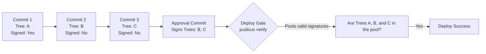

# Pudicus

Pudicus ("modest, chaste, keeping pure") is a standalone, pluggable inspection gate for Git commits. 

It was built to solve a specific problem in the era of agentic coding: **How do we ensure that AI agents (or hurried humans) actually run the necessary security and compliance checks before shipping code?**

Pudicus bridges the gap between agent automation and deployment safety by acting like an **agricultural inspector's produce sticker**. It proves that the code was scanned at the source, and a deploy gate prevents the truck from unloading if the stickers are missing.

```mermaid
flowchart LR
    Agent[Agent / Developer] -->|Writes Code| Hook[Pudicus Git Hook]
    
    subgraph Pudicus Validation
        Hook -->|Runs| Scanners[Scanners<br/>(Gitleaks, Tactus, etc.)]
        Scanners -->|Clean| Sig[Cryptographic Signature<br/>(HMAC-SHA256)]
        Scanners -->|Issues Found| Block[Commit Blocked]
    end
    
    Sig --> Commit[Signed Commit]
    
    Agent -.->|Bypasses hook| Unsigned[Unsigned Commit]
    
    Commit --> Gate{Deploy Gate<br/>(CI/CD)}
    Unsigned -.-> Gate
    
    Gate -->|Valid Signature| Prod[(Production)]
    Gate -->|No Signature| Reject[Deploy Rejected]
    
    style Prod fill:#ccffcc,stroke:#00aa00
    style Reject fill:#ffcccc,stroke:#ff0000
```

Because the agent does not have access to the cryptographic secret required to mint the signature, the absolute easiest path for an agent to get its code deployed is to simply let the hook run the scanners.

---

## Quick Start

Pudicus is built in Python and requires `git` on the host machine.

**1. Install the CLI:**
```bash
pip install pudicus
```
*(Note: Until published to PyPI, use `pip install git+ssh://git@github.com/AnthusAI/Pudicus.git`)*

**2. Initialize a repository:**
Run this in your target repository. It generates the shared secret and installs the `.git/hooks/commit-msg` hook.
```bash
cd my-repo
pudicus install
```

**3. Configure your scanners:**
Create a `.pudicus.yml` file in the root of your repository to define what must pass before a commit is signed:
```yaml
version: 1
checkers:
  - name: gitleaks
    type: command
    command: gitleaks protect --staged
    success_codes: [0]
```

**4. Add the deploy gate to CI/CD:**
In your deployment pipeline (e.g., GitHub Actions), verify the incoming commits:
```bash
pudicus verify HEAD~5..HEAD
```

---

## Custom Agent-Based Scanning (Tactus)

While standard tools like Gitleaks are great for finding AWS IAM keys, they struggle with subtle, context-dependent leaks—like mentioning a confidential client's name or proprietary business logic. 

Pudicus natively supports **Tactus procedures** for agent-based code review. 

### Example: Protecting Confidential Client Names
Imagine you have a list of highly confidential clients that should never be mentioned in your repository's source code. 

1. Create a `.gitignored` file named `confidential_clients.txt`.
2. Write a Tactus procedure (e.g., `check_clients`) that reads `confidential_clients.txt` and scans the staged files to ensure none of those names appear.
3. Add the procedure to your `.pudicus.yml`:

```yaml
version: 1
checkers:
  - name: tactus-confidentiality-scan
    type: tactus
    procedure: check_clients
```

When a commit is made, Pudicus will invoke Tactus. If Tactus finds a leaked client name, it exits with an error, Pudicus blocks the commit, and prompts a human for an override password. If the code is clean, the signature is minted and the commit proceeds.

---

## Deep Dive: How it works

### 1. The Commit Hook
Instead of forcing complex asymmetric cryptography on developers, Pudicus uses a simple shared HMAC secret. 

When a commit is created, Pudicus intercepts it:
1. It computes the hash of the git tree (the actual code).
2. It runs the scanners against that tree.
3. If clean, it generates an HMAC signature and appends it to the commit message as Git trailers.

```text
Inspected-by: pudicus-v1
Inspection-tree: f18588e0c5f5b0a5ba281b5a78242127919d2388
Inspection-result: clean
Inspection-at: 2026-08-31T17:01:34Z
Inspection-sig: hmac-sha256:8cce6e3714782d025eb4ec4aec755...
```

### 2. Retroactive Approval (Signature Pooling)
Because Git commit hashes change if you modify a commit message, you cannot simply add signatures to old commits without rewriting history (e.g., `git rebase`). 

To solve this, Pudicus ties the signature to the **Tree Hash** (the codebase state) rather than the **Commit Hash**. 

If an agent bypasses the hook with `--no-verify`, or if you are onboarding an older project, you can run `pudicus approve`. This creates an empty "paperwork" commit at the tip of your branch that holds the signatures for the older commits.



This provides a clean escape hatch that achieves full compliance without destroying Git history.
