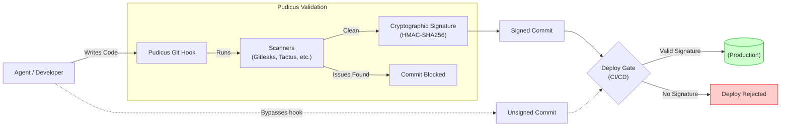
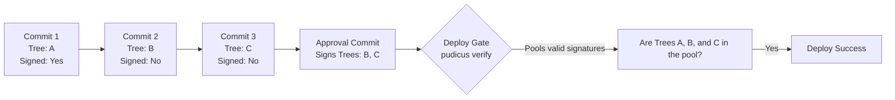

# Pudicus

Pudicus ("modest, chaste, keeping pure") is a standalone, pluggable inspection gate for Git commits. 

It was built to **shift left** the problem of secrets and confidential information leaking into source code. While it is technically possible to rewrite git history later (e.g., using `git filter-repo`) to scrub leaked keys, it is vastly better to catch the information *before* it ever gets committed to the local repository in the first place.

In the era of agentic coding, a specific problem arises: **How do we ensure that autonomous AI agents (or hurried humans) actually run the necessary security checks before committing code?**

Pudicus bridges the gap between agent automation and deployment safety by acting like an **agricultural inspector's produce sticker**. It intercepts and blocks secrets at the staging area, generating a cryptographically verifiable receipt proving the code was scanned. A downstream deploy gate then prevents the truck from unloading if the stickers are missing.


```mermaid
flowchart LR
    Agent["Agent / Developer"] -->|Writes Code| Hook["Pudicus Git Hook"]
    
    subgraph Pudicus Validation
        Hook -->|Runs| Scanners["Scanners<br/>(Gitleaks, Tactus, etc.)"]
        Scanners -->|Clean| Sig["Cryptographic Signature<br/>(HMAC-SHA256)"]
        Scanners -->|Issues Found| Block["Commit Blocked"]
    end
    
    Sig --> Commit["Signed Commit"]
    
    Agent -.->|Bypasses hook| Unsigned["Unsigned Commit"]
    
    Commit --> Gate{"Deploy Gate<br/>(CI/CD)"}
    Unsigned -.-> Gate
    
    Gate -->|Valid Signature| Prod[("(Production)")]
    Gate -->|No Signature| Reject["Deploy Rejected"]
    
    style Prod fill:#ccffcc,stroke:#00aa00
    style Reject fill:#ffcccc,stroke:#ff0000
```

Because the agent does not have access to the cryptographic secret required to mint the signature, the absolute easiest path for an agent to get its code deployed is to simply let the hook run the scanners.

---

## Quick Start

Pudicus is built in Python and requires `git` on the host machine.

**1. Install the CLI:**
```bash
pip install pudicus
```
To install from source instead: `pip install git+https://github.com/AnthusAI/Pudicus.git`

**2. Initialize a repository:**
Run this in your target repository. It generates the shared secret, installs the `.git/hooks/commit-msg` hook, and writes the zero-config defaults:
- `.pudicus.yml` — checker config running gitleaks against the shipped ruleset
- `.pudicus/gitleaks.toml` — the Pudicus-shipped sensitive-data ruleset (see below)

Existing files are never overwritten, so a repository can customize either file and re-run `pudicus install` safely.
```bash
cd my-repo
pudicus install
```

The installed hook pins the Python environment used for installation and keeps
the PATH that was available then, so checker binaries such as `gitleaks` remain
available when Git runs the hook. Re-run `pudicus install` after moving that
environment or installing a checker in a new location. Linked worktrees share
the same installed hook.

Pudicus receipts are HMAC trailers, not Git GPG/SSH signatures, so they do not
appear in `git log --show-signature`. Every machine that runs `pudicus verify`
must receive the same secret (by default `~/.config/pudicus/secret`, or the
path in `PUDICUS_SECRET_PATH`). The hook signs only new commits; use
`pudicus approve` when an existing commit range needs a retroactive receipt.

**3. Configure your scanners:**
`pudicus install` writes a working default `.pudicus.yml`, so the repository is protected out of the box (the `gitleaks` binary must be on the PATH). Customize it by editing the file in the root of your repository:
```yaml
version: 1
checkers:
  - name: gitleaks
    type: command
    command: gitleaks protect --staged --config .pudicus/gitleaks.toml --report-format json --report-path {report_file}
    success_codes: [0]
    finding_codes: [1]
```

**4. Add the deploy gate to CI/CD:**
In your deployment pipeline (e.g., GitHub Actions), verify the incoming commits:
```bash
pudicus verify HEAD~5..HEAD
```

---

## Out-of-the-Box Detection

`pudicus install` ships a gitleaks ruleset (`.pudicus/gitleaks.toml`) that
extends gitleaks' default secret rules with personal-data and crypto-wallet
rules, so a fresh install catches sensitive information with zero custom
configuration.

**Covered by gitleaks defaults:** AWS credential pairs, Google/Gemini API keys
(`AIza...`, default `gcp-api-key` rule), generic API keys in keyword context,
PEM private keys, and other standard secret formats.

**Added by the Pudicus ruleset:**

| Rule | What it catches |
|---|---|
| `pudicus-personal-email` | Personal email addresses (infrastructure identities like `git@github.com`, `@users.noreply.github.com` and `@example.*` placeholders are allowlisted) |
| `pudicus-home-path-posix` | Home-folder paths `/Users/<name>`, `/home/<name>` |
| `pudicus-home-path-windows` | `C:\Users\<name>` and `\Users\<name>` |
| `pudicus-session-uuid` | Bare UUIDs outside structural id fields (Kanbus `id`-style fields are allowlisted; a UUID in `session_id`-style fields or free text is reported) |
| `pudicus-actor-id` | `actor_id` / `user_id` / `author_id` JSON values |
| `pudicus-openai-key` | `sk-`, `sk-proj-`, `sk-svcacct-` OpenAI keys |
| `pudicus-anthropic-key` | `sk-ant-` Anthropic keys |
| `pudicus-eth-private-key` | Ethereum-style private keys (`0x` + 64 hex) |
| `pudicus-wif-key` | Bitcoin WIF private keys (compressed `K/L/M…`, uncompressed `5…`) |
| `pudicus-bip39-mnemonic` | BIP-39 seed phrases (12–24 words) in seed/mnemonic/recovery context |

### Crypto wallet material: what is and is not flagged

- **Flagged:** `0x`-prefixed 64-hex private keys, WIF-format Bitcoin keys,
  and 12/15/18/21/24-word BIP-39 seed phrases when they appear in
  seed/mnemonic context (`seed_phrase = "..."`, `recovery mnemonic: ...`).
- **Not flagged on their own:** public wallet addresses (Ethereum `0x` + 40
  hex, Bitcoin base58 addresses) and hash-like hex — SHA-256 digests, git
  SHAs, SHA-512. A bare 64-hex string with no `0x` prefix and no key-like
  keyword is shape-identical to a SHA-256 digest and git SHA, so it is
  deliberately only reported when keyword context (e.g. `private_key = …`)
  indicates it is a key. This trades a small residual gap (a bare,
  unlabeled 64-hex private key stored without any keyword) for not
  drowning developers in digest false positives. BIP-39 checksum
  validation is future validator work; phrase detection is shape- and
  context-based, so unlabeled bare word sequences that read like prose
  are not flagged.

### Why gitleaks is the bundled default

Evaluated out of the box (no custom config) on a synthetic fixture corpus
covering every category above, plus a false-positive pass over clean
content and a real ~2 MB repository tree:

| Scanner | Verdict |
|---|---|
| **Gitleaks 8.30.1** (bundled) | Catches API keys, crypto keys (with the Pudicus ruleset), and personal data via custom rules; deterministic exit codes (0 clean / 1 findings); zero false positives on clean content and on the real tree with the shipped ruleset; fast (~35 ms on 2 MB). |
| detect-secrets | No OpenAI/AWS-type detector hits for these formats — findings appear only as generic "High Entropy String"/"Secret Keyword"; misses mnemonics and all personal data; exit code 0 even with findings, so not gate-suitable without a wrapper. |
| TruffleHog (offline) | Its AWS detector caught the credential pair, but nothing else offline (OpenAI/Anthropic/Gemini/crypto/personal data all missed); scans git objects including gitignored files, which produces a different, noisier finding set; no allowlist mechanism for custom detectors. |
| Presidio | Built for PII text analytics; requires a 500 MB model, flags benign URLs/IPs/timestamps while missing every target category here (including `.test`-TLD emails and keys); unsuitable for commit gating. |

False-positive measurements with the shipped ruleset: **0 findings** on a
clean corpus (benign source/config files, placeholder emails and paths that
must stay allowed) and **0 findings** on a ~2 MB real repository tree
(PUDICUS_DOGFOOD_TREE dogfood test). The unit-test suite
(`tests/test_sensitive_rules.py`) regenerates all fixtures synthetically at
test time from a seeded RNG — no real credential ever appears in the repo.

---

## Custom Agent-Based Scanning (Tactus)

While standard tools like Gitleaks are great for finding AWS IAM keys, they struggle with subtle, context-dependent leaks—like mentioning a confidential client's name or proprietary business logic. 

Pudicus natively supports **Tactus procedures** for agent-based code review. 

### Example: Protecting Confidential Client Names
Imagine you have a list of highly confidential clients that should never be mentioned in your repository's source code. 

1. Create a `.gitignored` file named `confidential_clients.txt`.
2. Write a Tactus procedure (e.g., `check_clients`) that reads `confidential_clients.txt` and scans the staged files to ensure none of those names appear.
3. Add the procedure to your `.pudicus.yml`:

```yaml
version: 1
checkers:
  - name: tactus-confidentiality-scan
    type: tactus
    procedure: check_clients
```

When a commit is made, Pudicus will invoke Tactus. If Tactus finds a leaked client name, it exits with an error, Pudicus blocks the commit, and prompts a human for an override password. If the code is clean, the signature is minted and the commit proceeds.

---

## Deep Dive: How it works

### 1. The Commit Hook
Instead of forcing complex asymmetric cryptography on developers, Pudicus uses a simple shared HMAC secret. 

When a commit is created, Pudicus intercepts it:
1. It computes the hash of the git tree (the actual code).
2. It runs the scanners against that tree.
3. If clean, it generates an HMAC signature and appends it to the commit message as Git trailers.

```text
Inspected-by: pudicus-v1
Inspection-tree: f18588e0c5f5b0a5ba281b5a78242127919d2388
Inspection-result: clean
Inspection-at: 2026-08-31T17:01:34Z
Inspection-sig: hmac-sha256:8cce6e3714782d025eb4ec4aec755...
```

### 2. Retroactive Approval (Signature Pooling)
Because Git commit hashes change if you modify a commit message, you cannot simply add signatures to old commits without rewriting history (e.g., `git rebase`). 

To solve this, Pudicus ties the signature to the **Tree Hash** (the codebase state) rather than the **Commit Hash**. 

If an agent bypasses the hook with `--no-verify`, or if you are onboarding an older project, you can run `pudicus approve`. This creates an empty "paperwork" commit at the tip of your branch that holds the signatures for the older commits.


```mermaid
flowchart LR
    C1["Commit 1<br/>Tree: A<br/>Signed: Yes"] --> C2["Commit 2<br/>Tree: B<br/>Signed: No"]
    C2 --> C3["Commit 3<br/>Tree: C<br/>Signed: No"]
    C3 --> AC["Approval Commit<br/>Signs Trees: B, C"]
    
    AC --> Gate{"Deploy Gate<br/>pudicus verify"}
    Gate -->|Pools valid signatures| Check["Are Trees A, B, and C in the pool?"]
    Check -->|Yes| Deploy["Deploy Success"]
```

This provides a clean escape hatch that achieves full compliance without destroying Git history.
